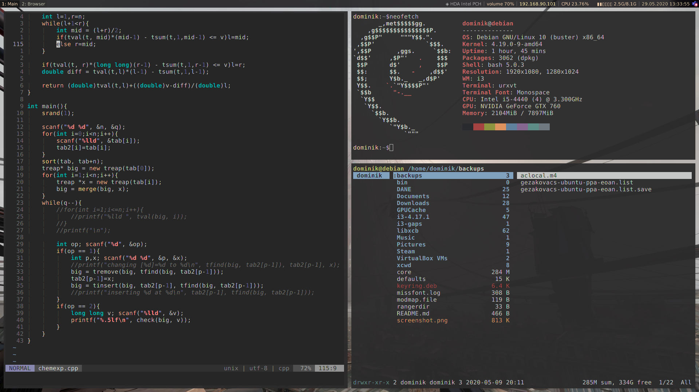

# README

## TODO LIST
* stworzyć __TODO.md__
* zmienić nazwę na __README.md__

## BAJERY:
* Moduły do i3blocks:
	* outputsink - pokaż obecny sink, śpm → wybierz (przez dmenu) spośród możliwych
	* printer - gdy domyślna kol. drukowania nie jest pusta, pokaż ikonę; lpm otwiera localhost Cups
	* volume - śpm otwiera pływające pavucontrol do miksowania głośności
	* ramusage - rysuje używaną obecnie pamięć RAM
